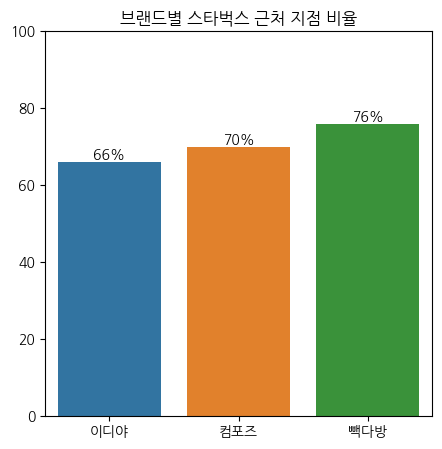

# 프랜차이즈 카페 입지 분석

- 알고 싶은 것: 이디야는 스타벅스 근처에 입점하는가?
- 가설: 커피 프랜차이즈는 대체로 스타벅스 근처에 있다.
  

- 데이터 수집
    - 동적 페이지 크롤링: Selenium
    - 정적 페이지 크롤링: BeautifulSoup
  

- 데이터 분석
    - 그래프 작성: matplotlib, pandas, seaborn
    - 한국어 주소로 GPS 경도/위도 수집: googlemaps
    - 수집한 경도/위도로 직선 거리 계산: haversine
  

- 분석 결과:
  - '근처'의 정의: 직선 거리 기준 도보 5분 이내 거리
  - 도보 이동 시간 기준: 성인 남성 기준 시간당 5km로 계산하므로, 분당 이동 거리는 83m라고 가정

  

